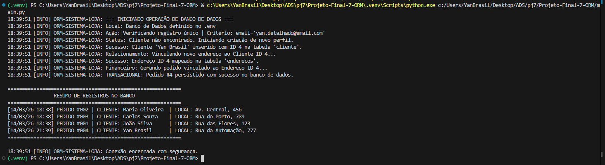
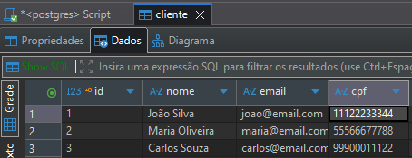

esta é uma integração python e postgresql usando sqlalchemy

PARA EXECUTAR DEVE

    instarlar as dependencias com

        pip install -r requirements.txt

    atualizar o .env para ficar de acordo com o banco

        algumas configs do .env ja estao estabelecidas
            (PADRAO) DB_USER=postgres
            (PADRAO) DB_HOST=localhost
            (PADRAO) DB_PORT=5432
            DB_PASSWORD=admin
            DB_NAME=ProjetoFinal_ModeloLogico_SISTEMA_DE_LOJA_VIRTUAL_SIMPLIFICADA

Neste projeto foi implementado o mapeamento das entidades do sistema:

    Cada tabela principal do projeto deve vira uma classe/entidade

    Cada entidade contem:

        chave primária

        campos básicos (colunas)

        relacionamentos coerentes com o modelo

📌 Regra prática:

    tabelas principais mapeadas

    mapear pelo menos 2 relacionamentos (ex.: 1–N e N–N, ou 1–N e N–1)

na imagem a baixo temos a tabela cliente antes de inserir os novos dados

aqui temos o log do terminal apos acrescentar as novas informacoes

agora a tabela atualizada apos o uso do codigo

na imagem abaixo temos a tabela cliente antes de inserir os novos dados:

aqui temos o log do terminal após acrescentar as novas informações:

agora a tabela atualizada após o uso do código:

